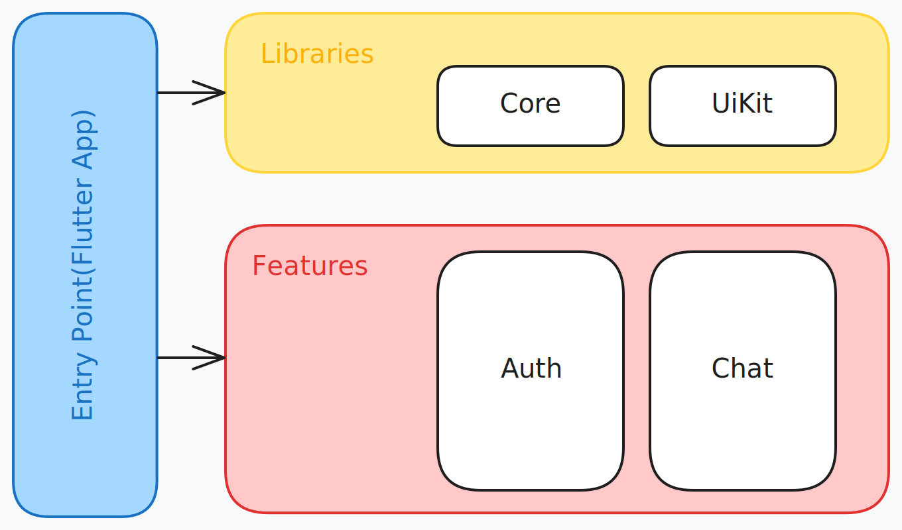
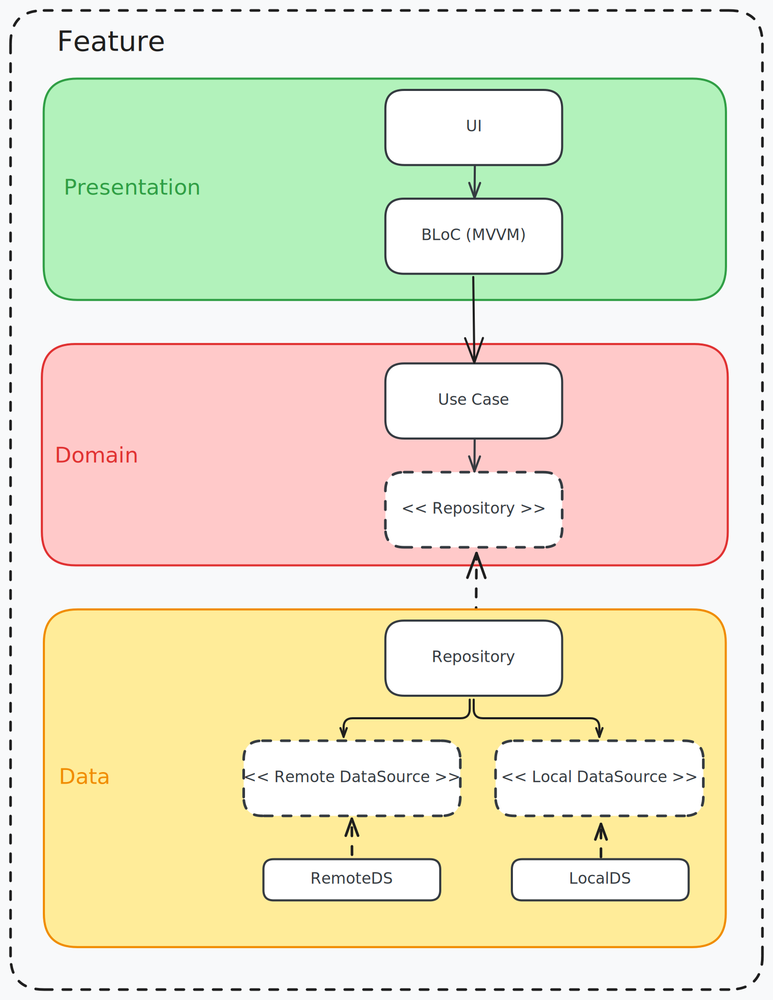

<p align="center">
    
</p>

<h1 align="center">Talky - Chat Application</h1>

Chat application built with Flutter that allows users to communicate with each other in real-time. The application consumes [Chat Api](https://github.com/Dsribass/chat-api) for user authentication and message delivery.

This project aims to demonstrate a monorepo modular architecture approach in Flutter. It utilizes the [Melos](https://pub.dev/packages/melos) tool for automating tasks, managing dependencies, and orchestrating the development workflow across multiple packages within the monorepo.

## 🏛️ Architecture



### Module Structure

The project is organized into two main types of modules:

- **Features**: These modules contain the domain business logic and specific features of the application.
- **Libraries**: These modules provide support functionalities, such as core utilities, UI components, infrastructure services, etc.

Each feature module is internally layered using a Three-Tier (Layered) Architecture, adhering to Clean Architecture principles.

> "Three-tier architecture is a client-server software architecture pattern in which the user interface (presentation), functional process logic ("business rules"), computer data storage and data access are developed and maintained as independent modules..."
> — [Multitier architecture](https://en.wikipedia.org/wiki/Multitier_architecture)

In this approach, each feature consists of three primary layers: data, domain, and presentation. Additionally, each feature module manages its own routing and dependency injection, ensuring modularity and maintainability. This structure promotes separation of concerns, scalability, and ease of testing across the application.



## 💻 Getting Started

To set up and run the Talky Flutter project, follow these steps:

1. **Clone the Repository**:
    Clone the project to your local machine:

    ```sh
    > git clone https://github.com/Dsribass/talky.git
    > cd talky
    ```

2. **Install Melos**:
    The project uses Melos for managing package dependencies. Install Melos globally:

    ```sh
    > dart pub global activate melos
    ```

3. **Bootstrap the Project**:
    Use Melos to bootstrap and fetch dependencies:

    ```sh
    > melos bootstrap
    ```
4. **Set Environment Variables**:
    Navigate to the `libraries/core` directory and duplicate the `.env.example` file to create environment-specific configuration files:

    - For production, create a `.env` file.
    - For development, create a `.env.dev` file.
    - For staging, create a `.env.stg` file.

    Then, update the configuration values in the respective files.

5. **Run the App**:
    This project contains 3 flavors:

    - development
    - staging
    - production

    To run the desired flavor either use the launch configuration in VSCode or use the following commands:

    ```sh
    > cd app

    # Development
    > flutter run --flavor development --target lib/main_development.dart

    # Staging
    > flutter run --flavor staging --target lib/main_staging.dart

    # Production
    > flutter run --flavor production --target lib/main_production.dart
    ```